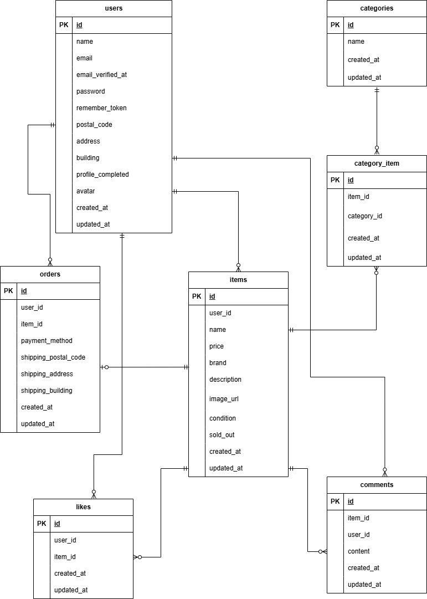

# フリマアプリ

## 環境構築

### Dockerビルド

1. `git clone https://github.com/maho756/furima-app.git`  
2. `docker-compose up -d --build`  

※MySQLは、OSによって起動しない場合があるので、それぞれのPCに合わせて `docker-compose.yml` ファイルを編集してください。

---

### Laravel環境構築

1. `docker-compose exec php bash`  
2. `composer install`  
3. `.env.example` ファイルから `.env` を作成し、環境変数を変更  
4. `php artisan key:generate`  
5. `php artisan migrate`  
6. `php artisan db:seed`

---

## 開発環境

- 商品一覧画面：http://localhost/
- ユーザー登録：http://localhost/register
- phpMyAdmin：http://localhost:8080/

---

## 使用技術（実行環境）
- Docker / Docker Compose  
- PHP 8.1.33  
- Laravel 8.83.8  
- MySQL 8.0.26  
- Nginx 1.21.1  
- MailHog（メール送信確認用）  
- Stripe（クレジットカード決済API）

---

## ER図

